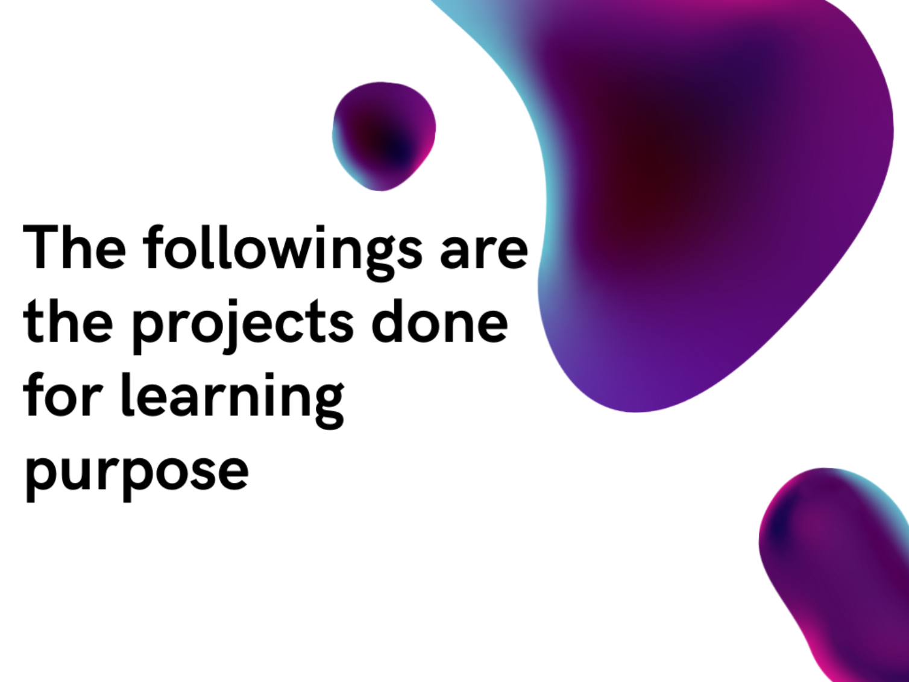

# Writing & formatting guide

Keep every post consistent by following this. (This file is a reference: it isn't published on the blog.)

## How a post is made of two parts

1. **The Markdown file** (`posts/<slug>.md`) holds *only the body*.
2. **The index entry** (an object in `posts/posts.json`) holds the title, date and tags.

The [Write](../write.html) page does both for you automatically. This guide is for when you write by hand or want to keep the style uniform.

## The index entry (`posts/posts.json`)

Newest first. Each entry:

```json
{
  "slug": "my-post",
  "title": "My Post Title in Title Case",
  "date": "2026-06-02",
  "tags": ["devops", "nlp"]
}
```

- **slug**: lowercase, words separated by hyphens (`-`). Must match the `.md` filename (`my-post` → `posts/my-post.md`).
- **title**: the headline. This is rendered as the page `H1`, so **don't repeat it** inside the Markdown body.
- **date**: `YYYY-MM-DD`. Controls ordering (newest first).
- **tags**: lowercase, hyphenated, 1–4 of them. Shown as `#hashtag` pills.

## The Markdown body (`posts/<slug>.md`)

### Top of the file
Optionally open with an italic one-line summary and a read-time, then a divider:

```markdown
*A one-line summary of what this post is about.*

**4 minute read**

---
```

Do **not** put the post title (`# Title`) at the top, the title comes from `posts.json`.

### Headings
- The title is the only `H1` (handled by the site).
- Use `##` for sections, `###` for sub-sections. Never use `#` inside a post.

### Dividers
Use `---` on its own line between major sections. It renders as the Bear-style `* * *`.

### Body text
- Write in normal paragraphs separated by a blank line.
- **Bold** for emphasis, *italics* for asides, `inline code` for commands, file names and identifiers.

### Code blocks
Always fence with the language so it's labelled clearly:

````markdown
```bash
pm2 start app.js --name app
```

```python
print("hello")
```
````

### Lists
```markdown
- bullet one
- bullet two

1. step one
2. step two
```

### Quotes
```markdown
> A pulled-out quote or question.
```

### Links & images
```markdown
[link text](https://example.com)

```
Image paths are relative to the site root (posts render inside `post.html` at the root), e.g. `images/...`, or use a full URL.

### Tags line (optional)
A trailing line like `#DevOps #Python` renders as plain text (no `#` heading), so it's safe to keep. Prefer putting the real tags in `posts.json`.

## Quick checklist before publishing
- [ ] `slug` matches the filename
- [ ] No `# H1` inside the body
- [ ] Sections use `##`
- [ ] Code blocks have a language
- [ ] Date is `YYYY-MM-DD`
- [ ] 1–4 lowercase tags
