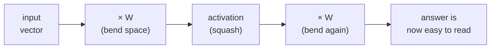
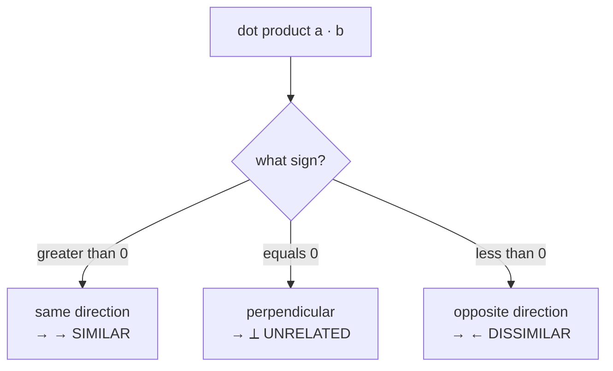

*The geometric intuition behind vectors, matrices, dot products and rank — and why "every AI model is just matrix math wearing a fancy hat."*

**5 minute read**

---

## S — Situation

Open any neural network and strip away the branding. Underneath GPT, Stable Diffusion and your recommender system is the *same* machinery: lists of numbers (**vectors**) being multiplied by grids of numbers (**matrices**), over and over.

- A word like *king* becomes a vector of 768 numbers (an **embedding**).
- An image becomes a vector of pixel values.
- A user's taste becomes a vector of preferences.
- The model's "knowledge" is just the numbers inside its matrices (the **weights**).

If you can *see* what these operations do geometrically, the math stops being scary and starts being obvious. That's the whole goal here.

---

## T — Task

By the end you should be able to answer, without hand-waving:

1. What is a vector, *really*? What is a matrix *doing*?
2. Why is the **dot product** the single most important operation in AI?
3. What do **linear independence** and **rank** tell us, and why do we care?
4. What is a **projection**, and why is it the secret behind regression and PCA?

---

## A — Action (the concepts, intuitively)

### Vectors = points *and* arrows
A vector `[3, 4]` is two things at once: a **point** at position (3, 4), and an **arrow** pointing from the origin to that point. Its **length** (magnitude) is `√(3² + 4²) = 5`. Its **direction** is which way the arrow points. In AI, *direction usually carries the meaning* and length carries the intensity.

### Matrices = transformations
A matrix is a machine that takes a vector in and spits a (usually different) vector out. Multiplying by a matrix can **rotate**, **stretch**, **squish**, or **flip** space. When a neural network layer does `output = W · input`, the weight matrix `W` is literally *bending the space* of the input so that useful patterns line up.

> A neural network is just: bend the space, squash it a bit (activation), bend again. Repeat until the answer is easy to read off.



### Dot product = "how aligned are these two?"
The dot product of `a` and `b` is `a·b = a₁b₁ + a₂b₂ + …`. Geometrically:

- **Positive** → the vectors point the *same* general way (similar).
- **Zero** → they're **perpendicular** (unrelated).
- **Negative** → they point *opposite* ways (dissimilar).



Divide by the lengths and you get **cosine similarity** — the number behind "find me documents *like* this one," attention scores in transformers, and face-recognition matches. Almost every "is X similar to Y?" question in AI is a dot product.

### Linear independence = "no freeloaders"
A set of vectors is **linearly independent** if none of them can be built by combining the others. If one *can* be — say feature `height_in_cm` and `height_in_inches` — it's **redundant**: it adds no new information but confuses the model (this is *multicollinearity*). Independent features each pull their own weight.

### Rank = "how much real information is here?"
The **rank** of a matrix is the number of *truly independent* directions inside it. A 3×3 matrix that secretly only spans a 2D plane has rank 2 — one direction is wasted. Rank tells you whether a system is solvable and whether information was lost. (LoRA, the cheap fine-tuning trick, works precisely because weight *updates* are low-rank — you only need a few real directions.)

### Projection = "the closest shadow"
Projecting vector `a` onto vector `b` asks: *if I could only move along `b`, what's the closest I can get to `a`?* It's the shadow `a` casts on `b`.

```text
        a
        ^
       /:
      / :
     /  :  <- "error": the part of a that b can't explain
    /   :     (always perpendicular to b)
   o----+--------------> b
   origin   ^
            proj of a onto b  (the shadow)
```

This is the entire idea behind **least-squares regression** (project the data onto the space your model can represent) and **PCA** (project high-dimensional data onto the few directions that matter most).

### Orthonormal basis = "clean, non-overlapping axes"
**Orthonormal** vectors are perpendicular (orthogonal) *and* length 1 (normal). They're the perfect coordinate system: no redundancy, no distortion. **Gram-Schmidt** is the recipe for turning any messy set of vectors into a clean orthonormal one — which keeps computations numerically stable.

---

## R — Result

You now have a mental model you can reuse everywhere:

| Operation | What it really means | Where you meet it in AI |
|---|---|---|
| Vector | a point/direction = "a thing" | embeddings, pixels, features |
| Matrix × vector | bend space | every layer's weights |
| Dot product | alignment / similarity | attention, search, cosine sim |
| Independence | no redundant features | clean inputs, stable training |
| Rank | real information content | LoRA, dimensionality |
| Projection | closest shadow | regression, PCA |

The payoff: when a paper says "we compute attention as scaled dot products" or "we use a rank-8 adapter," you'll *picture* it instead of memorising it.

---

## Out of the box — Q&A intuition (explain-to-anyone)

> **Q: What's a vector, in everyday words?**
> A grocery list of numbers that describes *one thing*. "This coffee: sweetness 7, bitterness 3, price 4." Three numbers → one coffee → one vector.

> **Q: And a matrix?**
> A recipe that changes every list the same way. Hand it a coffee, it hands back a "tea-ified" version. Same recipe, applied to anything you give it.

> **Q: Why is the dot product such a big deal?**
> It's a *similarity meter*. Point two arrows the same way → big number → "these are alike." That's how your phone finds photos of the same friend, and how search finds the right answer. One simple sum, used billions of times a second.

> **Q: What does "linear independence" mean to a non-techie?**
> No duplicate columns. If your spreadsheet has "height in cm" *and* "height in inches," one is a freeloader — it looks like new info but isn't. Independent = every column earns its seat.

> **Q: What is rank, simply?**
> How many *genuinely different* questions your data answers. Ten survey questions that all secretly ask "are you happy?" have a rank of one — lots of columns, little real information.

> **Q: What's a projection?**
> A shadow. Shine a light straight down on a leaning pencil: the shadow on the floor is the projection. "Given what I'm *allowed* to represent, what's the closest match to the truth?" That's regression in one sentence.

> **The one-line takeaway:** AI doesn't *think* — it measures angles and lengths between arrows in very high-dimensional space. That's it.

---

## Practice on paper (no computer)

Work these by hand — the goal is to *feel* the geometry.

1. **Length & direction.** For `v = [6, 8]`, compute its length. Draw it. What unit vector points the same way?
2. **Angle from a dot product.** Given `a = [1, 0]` and `b = [1, 1]`, compute `a·b`, both lengths, then the cosine of the angle. What's the angle in degrees?
3. **Similarity ranking.** Query `q = [2, 1]`. Which is more similar, `d₁ = [4, 2]` or `d₂ = [-1, 3]`? Justify using cosine similarity.
4. **Transformation by hand.** Apply `M = [[0, -1], [1, 0]]` to `[1, 0]` and `[0, 1]`. Plot the results. What geometric move is `M` (hint: it's a rotation — by how much)?
5. **Independence check.** Are `[1, 2]`, `[2, 4]`, `[1, 0]` linearly independent? If not, which one is the freeloader, and why?
6. **Rank.** What is the rank of `[[1, 2, 3], [2, 4, 6], [0, 1, 1]]`? (Look for rows that are multiples of each other.)
7. **Projection.** Project `a = [3, 4]` onto `b = [1, 0]`. What's the shadow vector? Now project onto `b = [0, 1]`. What do the two shadows together tell you about `a`?

*Answers are worth checking against NumPy afterwards — but do the paper first; that's where the intuition lives.*

#linear-algebra #math #intuition
